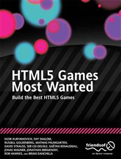

#Apress Source Code

This repository accompanies [*HTML5 Games Most Wanted*](http://www.apress.com/9781430239789) by Egor Kuryanovich, Shy Shalom, Russell Goldenberg, Mathias Paumgarten, David Strauss, Seb Lee-Delisle, Gatan Renaudeau, Jonas Wagner, Jonathan Bergknoff, Rob Hawkes, and Brian Danchilla (Apress, 2012).

Download the files as a zip using the green button, or clone the repository to your machine using Git.

##Releases

Release v1.0 corresponds to the code in the published book, without corrections or updates.

##Contributions

See the file Contributing.md for more information on how you can contribute to this repository.
